
<B>2019随机过程课程Project </B>

Shaofeng Zou

zousf19@mails.tsinghua.edu.cn

# 问题描述
类似课本上的例题，我们考虑相同的三人赌博场景：
		设有三个人参加赌博，最初这三个人拥有的硬币数分别为**a**、**b**和**c**，每次从三人中按先后次序随机选出两人，第一个被选中的人需要给第二个被选中的人一枚硬币。假定三个人在此游戏中被选中的概率是完全相同的，且每次选择都是相互独立的。在此基础上我们从以下几个角度进行讨论：

**Task 1:**

与例题不同的是，我们规定当其中一人没有硬币了，游戏就立刻结束，求此游戏结束的平均时间。请给出详细的推导过程。

**Task 2:**

沿用上一问规则，可将上述问题看作三维空间下在一个有限二维平面内的随机游走，请建立对应的随机游走模型并在此基础上讨论游戏结束时三人手中硬币数的分布。

**Hint：**显然游戏结束时的硬币数的分布与游戏开始时三人的硬币数有关，且在一定条件下存在对称性，可以在简单条件或假设下尝试给出分布的理论解，并通过仿真给出不同初始硬币分配下游戏结束时硬币分布的拟合结果，据此提出一般性的结论或猜想。

**Task 3:**

以上我们将该赌博问题转化为了粒子的随机游走问题，下面我们考虑如果粒子到达边界后会在下一时刻返回上一时刻位置，即给破产玩家翻盘的机会，尝试讨论这种情况下粒子在该区域中的分布有怎样的特点（理论推导或仿真）。

**Hint：**可以自由假设，如每个玩家仅有一次复活机会的情况，即粒子仅在首次到达上述平面每个边时可以回退至上一时刻位置。

# Task 1

**解：**

初始时三人的硬币数分别为$a$、$b$、$c$，设第n次赌博时三人的硬币数为$X_n$、$Y_n$、$Z_n$，当其中一个为0时游戏结束。

令$S_n=X_nY_nZ_n$，假设在第L次结束，则$S_L=0$。现在假设游戏结束的时间为$T$。

构造：$M_n=\sum_{k=1}^n (S_k-E(S_k|X_0,X_1,...X_{k-1},Y_0,Y_1,...,Y_{k-1},Z_0,Z_1,...Z_{k-1}))$

由鞅的构造方法3可知，{$M_n,n\geq1$}是鞅。

由于每次选择都是独立的，所以有：

$$E(S_k|X_0,X_1,...X_{k-1},Y_0,Y_1,...,Y_{k-1},Z_0,Z_1,...Z_{k-1}) $$

$$= E(S_k|X_{k-1},Y_{k-1},Z_{k-1})$$

$$ = E(S_k|X_{k-1}=x,Y_{k-1}=y,Z_{k-1}=z) $$

$$=\frac16[(x-1)(y+1)z+(x+1)(y-1)z+x(y-1)(z+1)+x(y+1)(z-1)+(x-1)y(z+1)+(x+1)y(z-1)] $$

$$=xyz-\frac13(x+y+z)$$

$$=S_{k-1}-\frac13(a+b+c)$$

带入$M_n$得：$M_n=S_n-S_0+\frac n3(a+b+c)$

由停时定理3可知：$E(M_T)=E(M_0)=0$

即：$E(M_T)=E(S_T)-E(S_0)+\frac {a+b+c}3E(T)=0$

而：$E(S_T)=0$

得：$E(T)=\frac3{a+b+c}E(S_0)=\frac{3abc}{a+b+c}$

**故游戏得平均结束时间为$\frac{3abc}{a+b+c}$。**

# Task 2

## **2.1 问题分析：**

​		我们需要将该赌博问题转化成数学问题，建立数学模型来分析完成上述目标的求解。上述问题可以看成一个在二维空间的随机游走，三人的手里的硬币数状态构成了一个Markov链。

​		众所周知，经过有限轮的赌博，最终一定会有人手里的硬币数为0，游戏结束，我们需求解游戏结束的平均时间以及三人手中的硬币数分布。理论上，可以归结为Markov链状态转移问题，即系统从某些非常返态出发到达常返态概率分布以及所需的时间问题。

​		在这里，我们将三人手里的硬币数所有可能组合称为状态空间，把游戏未结束时三人的硬币数组合称为非常返态，把游戏结束时三人的硬币数组合称为吸收态，把游戏过程中硬币数从某一组合到另一组合的概率称为转移概率。

​		则一步转移概率矩阵可以写为如下形式：$ P=( \begin{matrix}   D&R \\   0&P_0   \end{matrix} ) $。其中$D$表示非常返态之间的转移概率，$R$表示非常返态到吸收态之间的转移概率$P_0$为单位矩阵。

​		由此可推得：

1. 非常返态到吸收态的转移概率为：$U=(I-D)^{-1}R$，其中$I$为单位矩阵。

2. 从非常返态到吸收态所需的平均时间分布为：$w=(I-D)^{-1}g$，其中$g$为全为1的单位列向量。

   
   
   所以接下来我们的目标是：

1. 通过理论分析获得理论解，通过仿真计算获得模拟解，通过交叉对比，验证理论和仿真的正确性。

2. 最终是要求解两个问题：

   - 游戏结束所需的平均时间，即从某些非常返态出发到达常返态所需的时间。
   - 游戏结束时三人手中的硬币数分布，即从某些非常返态出发到达常返态的概率分布。

   

## 2.2 枚举非常返态和吸收态

​		设三个玩家大熊、胖虎、静香初始时三人手中的硬币总数为15。

​		例如当前大熊、胖虎、静香手里的硬币数为（2，2，11）。经过一次赌博后，大熊输，静香赢，则三者手中的硬币数为（1，2，12）。由于大熊还有一枚硬币，所以游戏可以继续。

​		又经过一轮赌博后，大熊又输了，胖虎赢，此时三者手中的硬币数变为（0，3，12），大熊出局，游戏结束。

​		由此可知非常返态（游戏可以继续）中，三者的硬币数都不为零。吸收态（游戏结束）中，三者只有一个人的硬币数为零。

### 2.2.1 枚举非常返态

​		设初始状态，三人的硬币总数为$N$，大熊、胖虎、静香初始时手中的硬币数分别为$i$、$j$、$N-i-j$，则非常返态的总状态数为：$p=\sum_{i=1}^{N-2}\sum_{j=1}^{N-i-1}1=(N-1)*(N-2)$。$N=15$时，$p=91$。

​		这里列举一些非常返态：

​		`[(1, 1, 13), (1, 2, 12), (1, 3, 11), (1, 4, 10), (1, 5, 9), (1, 6, 8), (1, 7, 7), (1, 8, 6), (1, 9, 5), (1, 10, 4)]`

### 2.2.2 枚举吸收态

​		设初始状态，三人的硬币总数为$N$，三人中有一人硬币数为0，另外两人的硬币数分别为$i$、$N-i$，则吸收态的总状态数为：$q=3*\sum_{i=1}^{N-1}1=3*(N-1)$。$N=15$时，$q=42$。

​		这里列举一些吸收态：

​		`[(0, 1, 14), (0, 2, 13), (0, 3, 12), (0, 4, 11), (0, 5, 10), (0, 6, 9), (0, 7, 8), (0, 8, 7), (0, 9, 6), (0, 10, 5)]`

## 2.3 计算从非常返态到吸收态的转移时间

### 2.3.1 构造D矩阵

​		某个非常返态到另一个非常返态的一步转移概率为$1/6$需满足：某个玩家前后状态的硬币数降低1，另一个玩家的前后状态的硬币数升高1。其他情况一步转移概率都为0。

### 2.3.2 理论计算游戏结束时赌博的平均次数

​		利用公式$w=(I-D)^{-1}g$计算，其中$g$为全为1的单位列向量。

​		这里列举部分w值：

​		`array([2.6, 4.8, 6.6, 8. , 9. ])`

### 2.3.3 仿真模拟游戏结束时赌博的平均次数

​		按照规则进行仿真模拟，遍历所有的非常返态，对每个非常返态模拟2000轮对局，统计每轮对局结束时三人手中的硬币分布。

### 2.3.4 数据分析

#### 2.3.4.1 理论计算与仿真模拟的平均绝对误差

​		计算两者之间的平均绝对误差为0.186，可以认为理论计算和实际仿真得结果基本一致。

#### 2.3.4.2 理论计算与仿真模拟对比

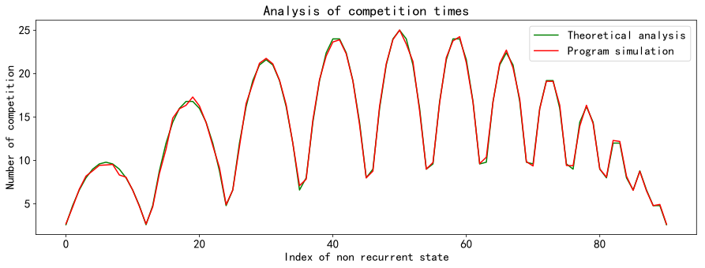

​		上图中横坐标是所有的初始的非常返态，纵坐标是从对应的非常返态到吸收态（从游戏开始到游戏结束）所对弈的平均次数。

#### 2.3.4.3 游戏结束时赌博的平均次数与初始硬币数分布关系

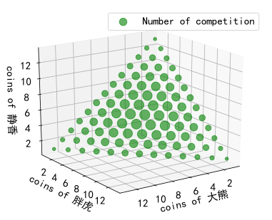

​		上图中，不同得绿色圆圈代表了不同得起始状态（初始得三个玩家得硬币分布）博弈至游戏结束所需要得平均博弈次数，绿色圆圈越大表示平均博弈次数也越大。

​		从中可以发现，当三名玩家得硬币分布接近一致时，所需要得博弈次数也越多，这和我们的认知常识是一致的。

## 2.4 计算从非常返态到吸收态的转移概率

### 2.4.1 构造R矩阵

​		非常返态到吸收态的转移概率计算：

​		1.  三名玩家中，有个玩家的硬币数降低1，另一个玩家的硬币数增加1。

​		2.  硬币数变为0的玩家，前一状态的生命值为1。

​		符合上述条件的非常返态和吸收态之间的转移概率为1/6，否则为0。

### 2.4.2 理论计算游戏结束时硬币数的分布

 		利用公式：$U=(I-D)^{-1}R$计算即可，其中$I$为单位矩阵。得到的$U$矩阵大小为91*42。

### 2.4.3 仿真模拟游戏结束时硬币数的分布

​		按照规则进行仿真模拟，遍历所有的非常返态，对每个非常返态模拟2000轮对局，统计每轮对局结束时三人手中的硬币分布概率。

### 2.4.4 数据分析

#### 2.4.4.1 理论计算与仿真模拟的平均绝对误差

​		计算两者之间的平均绝对误差为0.00168，可以认为理论计算和实际仿真得结果基本一致。

#### 2.4.4.2 理论计算与仿真模拟对比

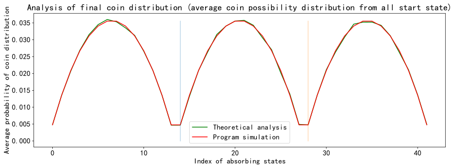

​		上图中横坐标是所有的初始的吸收态，纵坐标是从对应的从所有非常返态到该吸收态的平均概率。可以看出分布具有对称性。由于是统计了所有的非常返态，平均下来使得理论和仿真之间的误差很小。

#### 2.4.4.3 从初始硬币数为(5,5,5)到游戏结束时每种硬币数分布的概率

 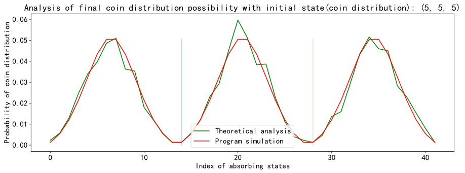

​		上图中横坐标是所有的初始的吸收态，纵坐标是从对应的从非常返态(5,5,5)到该吸收态的概率。

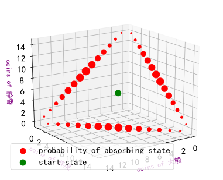

​		上图中，绿色的圆圈表示初始状态（初始得三个玩家的硬币数为(5,5,5)）的位置。

​		不同的红色圆圈代表了从起始状态博弈至游戏结束的硬币分布概率，红色圆圈越大表示最终为该硬币分布的概率越大。

​		从中可以发现，当三名玩家得硬币分布接近一致时，最终的硬币分布也是对称的，且另外两个仍有硬币的玩家的硬币数也是大概率是一样的，和我们的认知常识保持一致。

#### 2.4.4.4 任选几个初始硬币数分布到游戏结束时的硬币数概率分布

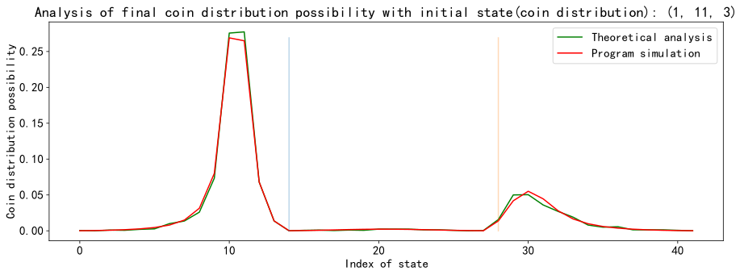

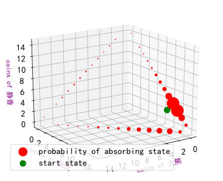

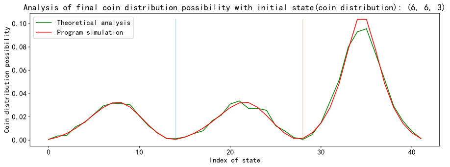

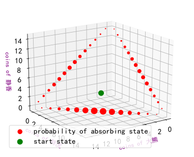

​		显然，初始硬币数越少的玩家越有可能会输，所以最终硬币数的分布会拥有初始状态分布的趋势。

​		从上图中很明显可以看出，初始状态对吸收状态的分布影响很大。

#### 2.4.4.5 计算游戏结束时三个玩家的硬币数期望

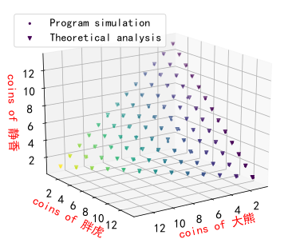

​		在对游戏结束时三个玩家的硬币数期望计算中，理论计算和实际仿真出来得平均绝对误差为0.0404，可以认为理论计算和实际仿真得结果基本一致。

​		上图中表示从任一的初始硬币数分布开始博弈，游戏结束时，三人手中的硬币数分布期望和初始硬币数分布一致。

​		这个结果也是和常识一致的。在公平的条件，除去技艺的高低，每个人每局胜负的可能性都是一致的，所以近似盈亏相等，只不过因为开局拥有的钱少所以就先出局。

#### 2.4.4.6 在某个指定玩家首先出局的情况下，计算其他两名玩家的硬币期望数

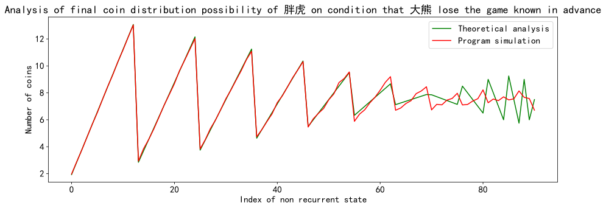

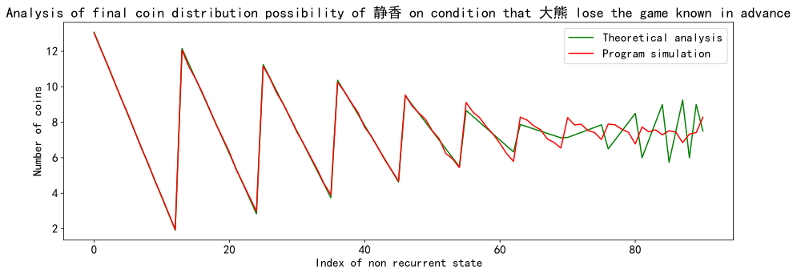

令(a,b,c)分别为三名玩家初始硬币数，(x,y,z)为三名玩家游戏结束时硬币数。

则游戏结束时某名指定玩家没有硬币时其他两位玩家硬币分布的计算公式服从规律：

$$x=0$$ 则：

$$y=b+a * \frac c{b+c}$$

$$z=a+c-a * \frac c{b+c}$$

根据对称性，易知y=0时以及z=0时其他两名玩家的硬币分布数。

上图中，在从第60个之后的非常返态对应的硬币分布数在理论计算和仿真模拟上有较大的出入，我们首先看下倒数10个非常返态：

`[(10, 1, 4), (10, 2, 3), (10, 3, 2), (10, 4, 1), (11, 1, 3), (11, 2, 2), (11, 3, 1), (12, 1, 2), (12, 2, 1), (13, 1, 1)]`

我们发现由于统计非常返态的顺序问题，最后几个非常返态的状态之间变化较大。对非常返态重新排序，按照和硬币分布最均匀状态的距离排序。

则平均对抗时间的变化曲线变为：

上图能够很明显看出初始硬币分布越均匀，平均博弈时间越大，硬币分布差距越大，平均博弈时间越短。

在某个指定玩家首先出局的情况下，其他两名玩家的硬币期望数的变化曲线变成：

这样看好像两者更加接近了（但其实数据还是没变的）。

计算平均绝对误差为0.327，误差较少，可以认为利用程序模拟最终的结果的分布与理论结算近似一致。

# Task 3

## 3.1 问题描述

添加了复活机制，使得赌博这个马尔可夫链中的每个状态不仅仅由玩家手中的硬币数决定，还由玩家是否具有复活机会决定。

换个角度可认为每个玩家拥有生命值，设三个玩家大熊、胖虎、静香分别初始时拥有两条命，三人手中的硬币总数为15。

## 3.2 枚举非常返态和吸收态

例如当前大熊、胖虎、静香手里的硬币数为（1，2，12），三人的生命值都为（2，2，2）。

经过一次赌博后，大熊输，静香赢，则三者手中的硬币数为（0，2，13），三人的生命值为（2，2，2）。

由于大熊还有机会复活，回到上局状态后大熊失去一条命。则三者手中的硬币数变为（1，2，12），三人的生命值变为（1，2，2）。

又经过一轮赌博后，大熊又输了，胖虎赢，由于大熊只有最后一条命，所以认为大熊出局，游戏结束。此时三者手中的硬币数变为（0，3，12），三人的生命值变为（1，2，2）。

由此可知非常返态（游戏可以继续）中，三者的硬币数都不为零，且生命值都大于等于1。吸收态（游戏结束）中，三者只有一个人的硬币数为零，且这个人的生命值等于1。

某位玩家如大熊只有1枚硬币，且生命值大于1时，如上述中的某个状态三人的硬币数为（1，2，12），生命值为（2，2，2），记为状态（1，2，12，2，2，2）。

如果在某次博弈中，大熊输给了静香，则根据规则状态大熊丢失一个生命，经历了状态 A（1，2，12，2，2，2）-> B（0，2，13，2，2，2）-> C（1，2，12，1，2，2）

为了满足Markov链的性质，即下一状态只取决于上一状态和博弈过程。

但从B状态到C状态过程中不存在博弈只有复活（重返游戏）的过程，复活时B还可以进入其他状态如D（1，1，13，1，2，2）。

故为使其仍满足Markov链性质，下面略去状态B，从状态A且博弈中大熊只要输了后进入直接进入状态C，即A（1，2，12，2，2，2）-> C（1，2，12，1，2，2）。以下计算的转移时间不包括这里面的B状态，即复活时的状态。

###  3.2.1枚举非常返态

设初始状态，三人的硬币总数为$N$，三人的生命值都为$HP$，大熊、胖虎、静香初始时手中的硬币数分别为$i$、$j$、$N-i-j$，则非常返态的总状态数为：$p=HP^3*\sum_{i=1}^{N-2}\sum_{j=1}^{N-i-1}1=(N-1)*(N-2)*HP^3$。$N=15$时，$p=728$。

上述非常返态考虑到了游戏中所有可能出现的状态，但是我们假设游戏开始时三人血量都一样，所以非常返态中有$91$个为初始状态，我们将这$91$个非常返态暂且称为有效非常返态。

这里枚举几个非常返态：

`[(1, 1, 13, 1, 1, 1), (1, 1, 13, 1, 1, 2), (1, 1, 13, 1, 2, 1), (1, 1, 13, 1, 2, 2), (1, 1, 13, 2, 1, 1), (1, 1, 13, 2, 1, 2), (1, 1, 13, 2, 2, 1), (1, 1, 13, 2, 2, 2), (1, 2, 12, 1, 1, 1), (1, 2, 12, 1, 1, 2)]`

### 3.2.2 枚举吸收态

设初始状态，三人的硬币总数为$N$，三人中有一人硬币数为0，另外两人的硬币数分别为$i$、$N-i$，则吸收态的总状态数为：$q=HP^2*3*\sum_{i=1}^{N-1}1=3*(N-1)*HP^2$。$N=15$时，$q=168$。

上述吸收态既包括了游戏结束时三人的硬币数分布又包括了游戏结束时三人剩余的血量。由于到我们只考虑硬币数分布，所以我们可以构建$42$个只包含硬币数的吸收态，我们将这$42$个非吸收态暂且称为有效吸收态。

这里列举一些吸收态：

`[(0, 1, 14, 1, 1, 1), (0, 1, 14, 1, 1, 2), (0, 1, 14, 1, 2, 1), (0, 1, 14, 1, 2, 2), (0, 2, 13, 1, 1, 1), (0, 2, 13, 1, 1, 2), (0, 2, 13, 1, 2, 1), (0, 2, 13, 1, 2, 2), (0, 3, 12, 1, 1, 1), (0, 3, 12, 1, 1, 2)]`

## 3.3 计算从非常返态到吸收态的转移时间

### 3.3.1 构造D矩阵

某个非常返态到另一个非常返态的转移概率计算：

1. 如果所有玩家生命值都未降低，则存在转移概率的非常返态之间需满足：

   * 某个玩家前后状态的硬币数降低1，另一个玩家的前后状态的硬币数升高1

   * 该转移概率为1/6

2. 如果有玩家生命值降低，则存在转移概率的非常返态之间需满足：

   * 该玩家之前的状态的硬币数为1，前后状态除了该玩家的生命值有降低，其他都未变化

   * 该转移概率为1/3，因为该玩家输的话有两种可能性，比如大熊输了，那他可能输给了胖虎，也可能是静香

### 3.3.2 理论计算游戏结束时赌博的平均次数

​		利用公式$w=(I-D)^{-1}g$计算，其中$g$为全为1的单位列向量。选取有效非常返态所对应的$w$分量，即为valid_start_w。

​		这里列举部分valid_start_w值：

​		`array([ 7.83365206, 11.74145578, 14.8988201 , 17.33571726, 19.06863454])`

### 3.3.3 仿真模拟游戏结束时赌博的平均次数

按照规则进行仿真模拟，遍历所有的有效非常返态，对每个有效非常返态模拟2000轮对局，统计每轮对局结束时三人手中的硬币分布。

### 3.3.4 数据分析

#### 3.3.4.1 理论计算与仿真模拟的平均绝对误差

计算两者之间的平均绝对误差为0.316，可以认为理论计算和实际仿真得结果基本一致。

#### 3.3.4.2 理论计算与仿真模拟对比

上图中横坐标是所有的初始的非常返态，纵坐标是从对应的非常返态到吸收态（从游戏开始到游戏结束）所对弈的平均次数。蓝线代表未添加复活机制的平均对弈次数。
可以看出添加了复活机制后，平均对弈次数有所提升。

#### 3.3.4.3 游戏结束时赌博的平均次数与初始硬币数分布关系

上图中，不同得绿色圆圈代表了不同得起始状态（初始得三个玩家得硬币分布）博弈至游戏结束所需要得平均博弈次数，绿色圆圈越大表示平均博弈次数也越大。

从中可以发现，当三名玩家得硬币分布越接近，所需要得博弈次数也越多。相比于没有复活机制，所需的对弈次数也更多，因此这里的圈相较Task 2更大。

### 3.4 计算从非常返态到吸收态的转移概率

### 3.4.1 构造R矩阵

非常返态到吸收态的转移概率计算：

1. 三名玩家的生命值都未有变化。
2. 三名玩家中，有个玩家的硬币数降低1，另一个玩家的硬币数增加1。
3. 硬币数变为0的玩家，前一状态的生命值为1。

符合上述条件的非常返态和吸收态之间的转移概率为1/6。 

### 3.4.2 理论计算游戏结束时硬币数的分布

利用公式：$U=(I-D)^{-1}R$计算即可，其中$I$为单位矩阵。得到的$U$矩阵大小为728*168。

非常返态包括了已丢失部分生命的状态，我们只需要全为满血的初始非常返态到吸收态的概率

吸收态中又包含了生命值部分，而我们关注的是硬币数分布，所以根据硬币数分布再对具有相同硬币数分布的吸收态进行合并。

最终得到的有效**valid_U**为91*42。

### 3.4.3 仿真模拟游戏结束时硬币数的分布

​		按照规则进行仿真模拟，遍历所有的有效非常返态，对每个有效非常返态模拟2000轮对局，统计每轮对局结束时吸收态的概率，并根据硬币分布对具有相同分布的进行合并获得三人手中的硬币分布概率。

### 3.4.4 数据分析

#### 3.4.4.1 理论计算与仿真模拟的平均绝对误差

计算两者之间的平均绝对误差为0.00183，可以认为理论计算和实际仿真得结果基本一致。

#### 3.4.4.2 理论计算与仿真模拟对比

 

上图中横坐标是所有的游戏结束时的硬币分布，纵坐标是从对应的从所有非常返态到该硬币分布的平均概率。

和没有复活机制的结果相比，增加复活机制之后，游戏结束时的硬币分布稍微均匀一些。

#### 3.4.4.3 游戏结束时硬币数分布与血量关系

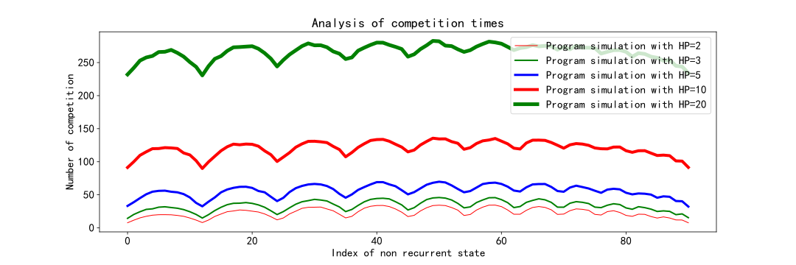

上图中横坐标是所有的初始的非常返态，纵坐标是从对应的非常返态到吸收态（从游戏开始到游戏结束）所对弈的平均次数。

显然，初始血量越大，所需要的平均博弈时间也越大。观察可知复活次数与血量的关系近似成线性关系。

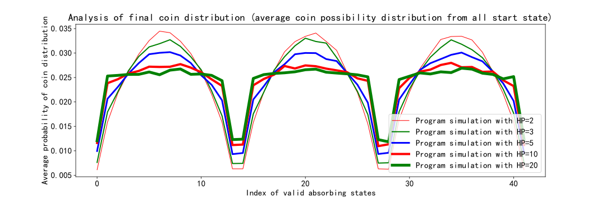

上图中横坐标是所有的游戏结束时的硬币分布，纵坐标是从对应的从所有非常返态到该硬币分布的平均概率。

可以看出从一开始有三个明显的波峰近似变成了三个矩形波，每个吸收态的概率随着血量逐渐平衡，即某个指定玩家率先出局的情况下，其他两名玩家的硬币分布具有更大的不定性。

 probability of coin distribution 2D view comparison.svg)

上图为游戏开始时三人手中的硬币分布为（2，5，8）时，游戏结束的硬币分布概率。图中横坐标是所有的游戏结束时的硬币分布，纵坐标是从到达该硬币分布的平均概率。

可以看出，随着血量增加即复活次数增多，图像的三个波峰差距逐渐减小。初始状态的硬币数差距所带来的影响逐渐减弱，当血量足够多的情况下，可以忽略初始状态的影响！